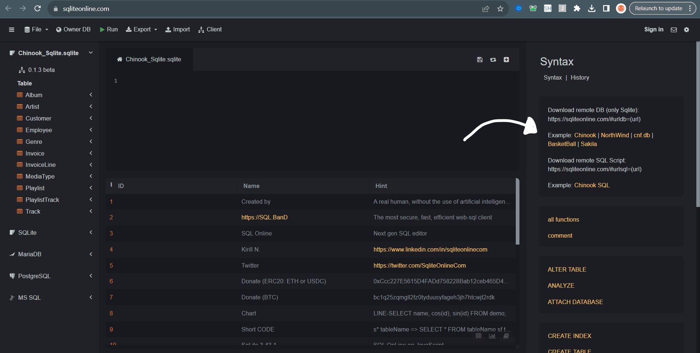

# 📦 Sample Databases for Testing

## 🤷 Why are we using SQL Online IDE?

SQL Online IDE provides a unanimous testing environemtn at ANYONE can access regardless of operating system. This makes it the perfect even playing field to create tests for candidates. 

1️⃣ **Accessibility**: can be use via any web browser.

2️⃣ **Reliability**: databases are provided and ready to query.

3️⃣ **Simplicity**: simple is more effective, less steps for failure.

This means during a live SQL interview there is no preparation needed...from both parties.

## 🗂 Dataset Overview

We have categorised the datasets according to their complexity and domain to help you choose the right one for your testing needs:

| Dataset | Category | Source | Difficulty | Description |
| - | - | - | - | - |
| Northwind | Business | Microsoft | ⭐ | A product sales company dealing with food items, suppliers and shipments. |
| Chinook | Media | Github | ⭐⭐ | A fictional digital music store or platform like iTunes or Spotify. |
| Sakila | Entertainment | MySQL | ⭐⭐| A movie rental store similar to the old Blockbuster model. |
| More soon |... | ... | ... | ... |

## How to access?

Jump onto the SQL Online IDE via this URL: https://sqliteonline.com/

Follow the below image prompts to load the relevant warehouse.

	
	
	
      
	
					
			
	
   

## Entity Relationship Diagrams (ERDs)

**Northwind ERD**

	
	
	
      
	
					
			
	
   

**Sakila ERD**

	
	
	
      
	
					
			
	
   

   **Chinook ERD**
   

   
	
	
	
      
	
					
			
	
   

